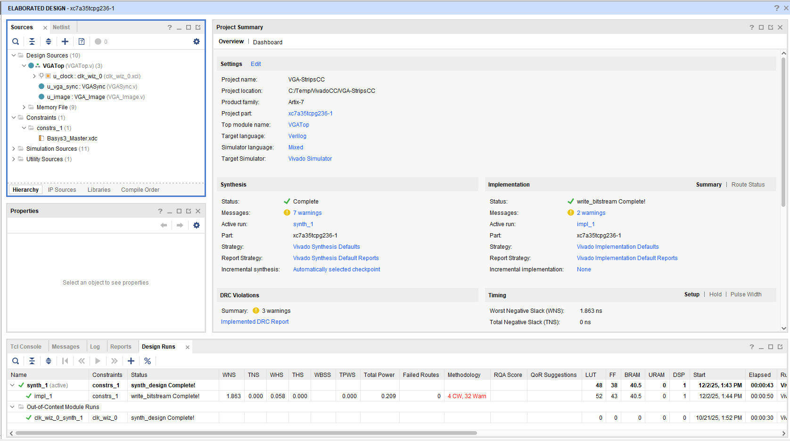
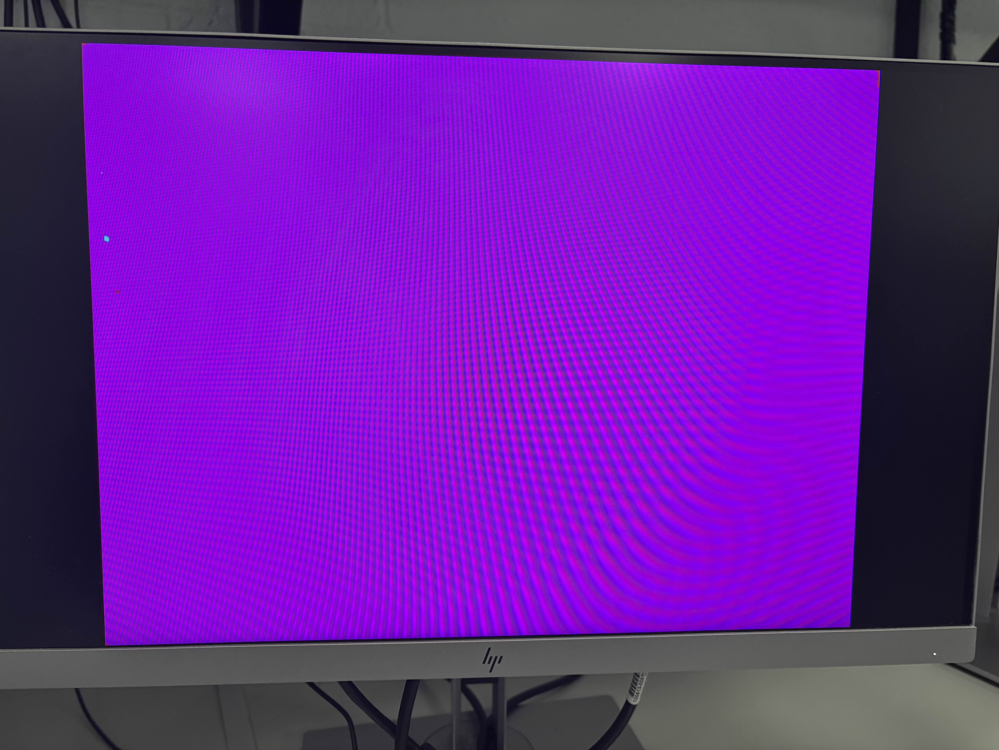
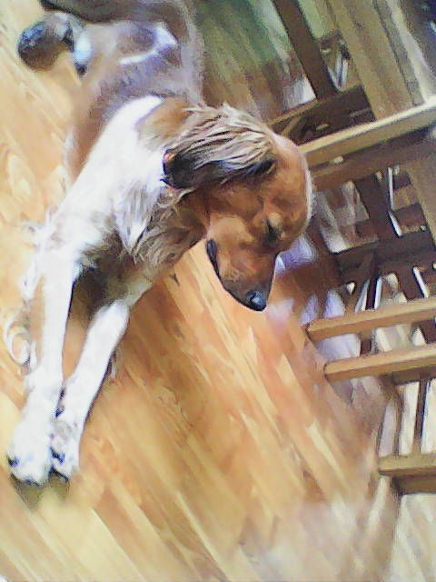
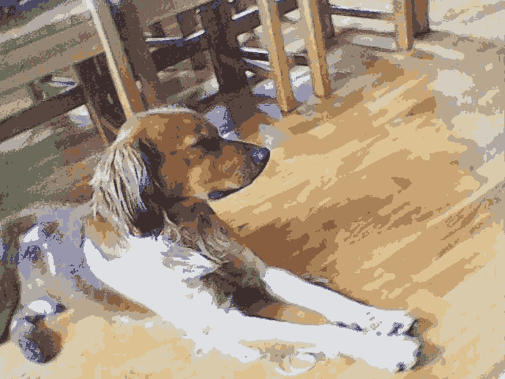
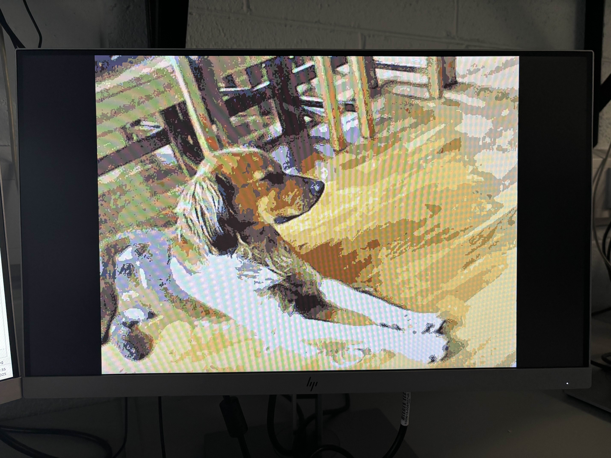
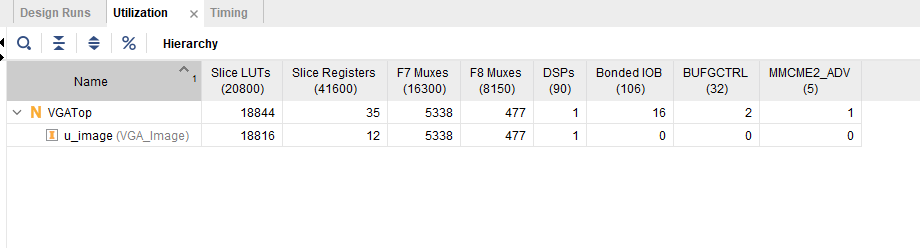

This is my write up on my SOC FPGA Project. It details the steps taken to display a 640x480 image over VGA using the Basys 3 development board.

## **Template VGA Design**
### **Project Set-Up**

### **Template Code**

For the project we received a project template. This template included all the files needed to display colour strips on the monitor. The template included three files.
 - VGATop.v
    - The top level verilog file. This calls all the other modules and connects the signals in between them.
 - VGASync.v
    - Creates the signals for VGA to work. A horizontal sync and vertical sync signals are generated here. These signals are directly sent to the monitor. A pulse on the horizontal sync signify's the end of the line, while a pulse on the vertical sync means the end of a full frame.
 - VGAColourCycle.v
    - Generates the colour data for displaying on the screen. As the name suggests it cycles through a few colors.
 - Basys3_Master.xdc
    - Constraints file for the board. Needed to set up the switch for the reset, the outputs for the VGA connector and for the clock.
 - Testbench.v
    - Test bench used to see if the design works correctly.

### **Synthesis**
Synthesis is the process of converting the high level code to logic that the FPGA can implement. This process decides on what components on the FPGA to use such as DSP's or block ram.

Implementation is responsible for picking the hardware to use on the board and routing signals.

### **Demonstration**
The template code cycles through a few colours.

## **My VGA Design Edit**
My idea was to use the memory on the FPGA to store pixel data of an image. It would take the rows and columns as inputs and output the 12 bit colour value. 4 bits each for red, blue and green. The idea is not too complex as at its core its just a very large look up table.

I researched how to load large amounts of data into a verilog file and found the `$readmemh` function this allowed the reading in of a file into memory.
https://projectf.io/posts/initialize-memory-in-verilog/

But first I needed a file to load. So I created a program to create a memory file filled with one colour value. And then manually changed a few values to a different colour. This worked and produced the following image

### **Image Pre-processing**

A image has to be converted before it can be used with Vivado. To do this I used a combination of GIMP and a few programs I developed. 

#### **Original Image**

#### **Rotated and Reduced Colours**

This step was done using GIMP a free image processing tool.

#### **Conversion to memory file**
The image need to be in the correct format for the `$readmemh` function. Each pixel value needs to be in hexadecimal and a white space character in between.
I picked the simplest image format i could find being PPM (Portable Pixel Map). The format has a very simple header followed by raw pixel values. This made it easy to extract pixel values and put them in the correct format. 

The first program (PPM_To_Mem.c) takes a PPM image as an input and outputs a .mem file.

### **Running Out of Room**
When changing out the image from the colour fill to anything else. It was unable to synthesize the project. I ran out of LUTs (Look up tables) to use. This was strange as it the design worked with the colour fill image but not anything else. It seems that it was optimizing out most of the data from the colour fill image but it couldn't do this for any other as they are more complex images using more colours.

The image takes up around 3.8 Mbits and even if i used block ram. I wouldn't have the space. The solution I chose was to use a colour pallet. I settled on 16 colours. This allowed the size of the image to be reduced to 1.22 Mbits. This required another program to convert the memory file to use a pallet.

The second program (Mem_To_Pallet) I wrote took the input of the last program and outputs two files. One containing the image data converted to use a pallet, and the other being the pallet itself. The code for both programs can be found in the `src` folder in this repository.

After changing the code to use the pallet and fixing how the address was calculated it worked as intend. Below is the final output.

### **Block Ram (BRAM)**
The FPGA on the Basys3 board has 1,800 Kbits of block ram. I had issues when trying to use it. It would not infer even when told to do so. Below is the utilization report without using block ram.

And this is the RTL output.

After getting the project working I went back and separated out the code. This turned out to be the issue on why it wasn't inferring BRAM.

As you can see the BRAM is being used.

